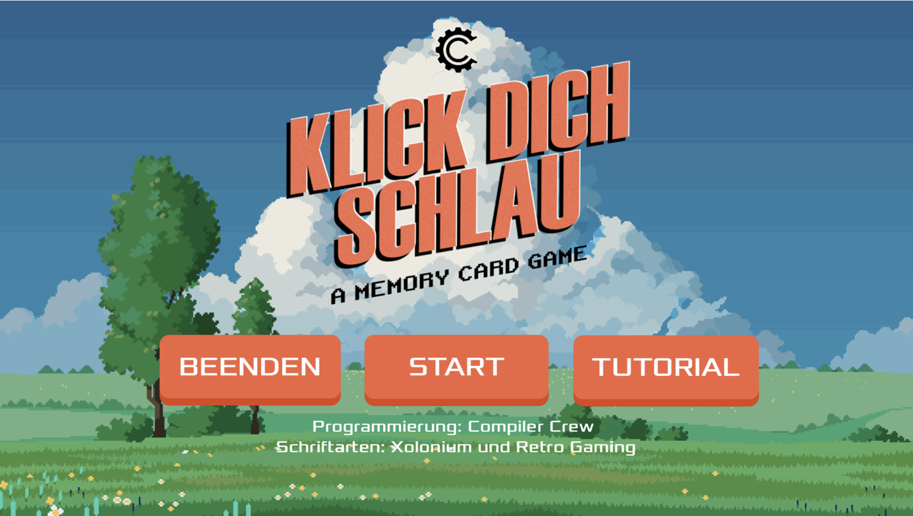
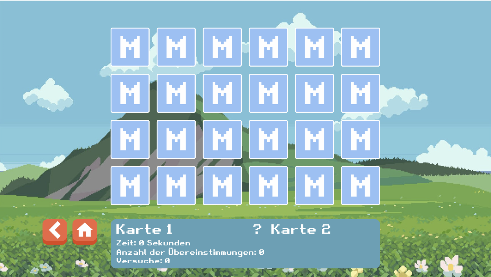

# Klick dich schlau: A memory card game created with the Godot engine

A simple **Memory Card Game** called "Klick dich schlau", built with the Godot Engine.  
Players flip cards to find matching pairs while the game tracks attempts and completion time.  
The project is designed as a clean, beginner‑friendly example of how to structure a small game in Godot using scenes, signals, animations, and basic game logic.

## Features
- Flip‑to‑reveal card mechanic  
- Match detection and scoring  
- Shuffle system for random layouts  
- Simple UI with attempts and timer  
- Modular scene structure for easy customization  
- Lightweight and fully open‑source

## Getting Started
1. Clone the repository  
2. Open the project in Godot  
3. Press **Play** to start the game

## Some screenshots from the game

